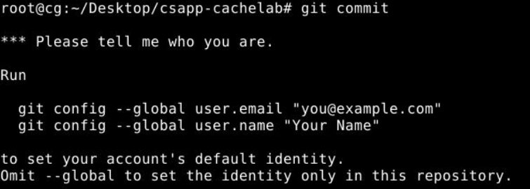

# Data Lab 实验说明

---

本实验中，你需要利用整型和浮点数的位表达形式，来解开一些谜题，一共有15个需要补充的函数，**除了完成代码进行在线评测之外，还需要提交实验报告。**

## 谜题介绍

待实现的15个函数功能，一共分为三种类型。

表 1 位运算

| 函数名称 | 功能描述 | 难度等级 | 最大操作数 |
| --- | --- | --- | --- |
| bitXor(x, y) | 只用 & 和 ~ 实现 x^y | 1 | 14 |
| getByte(x, n) | 从字x中取出第n个字节 | 2 | 6 |
| logicalShift(x, n) | 逻辑右移 | 3 | 20 |
| bitCount(x) | 计算x中1的数目 | 4 | 40 |
| conditional(x,y,z) | 类似于C语言中的 x ? y : z | 4 | 12 |

表 2 二进制补码运算

| 函数名称 | 功能描述 | 难度等级 | 最大操作数 |
| --- | --- | --- | --- |
| tmin() | 返回最小的补码 | 1 | 4 |
| fitsBits(x,n) | x的补码是否可以表示成n位 | 2 | 15 |
| dividePower2(x,n) | 计算x/(2ⁿ) | 2 | 15 |
| negate(x) | 不用负号得到-x | 2 | 5 |
| howManyBits(x) | 计算表达x所需的最少位数 | 4 | 90 |
| isLessOrEqual(x,y) | x <= y? | 3 | 24 |
| intLog2(x) | 计算⌊log2(X)⌋ (向下取整) | 4 | 90 |

表 3 浮点数运算

| 函数名称 | 功能描述 | 难度等级 | 最大操作数 |
| --- | --- | --- | --- |
| floatAbsVal(uf) | 计算f的绝对值的位级表示 | 2 | 10 |
| floatScale1d2(uf) | 计算0.5*f的位级表示 | 4 | 30 |
| floatFloat2Int(uf) | 计算(int)f的位级表示 | 4 | 30 |

*bits.c* 文件：

这个是源码文件，里面包含了上述待实现的函数，已经给出函数原型。实验内容是按照每个函数的要求来编写实现其功能的代码。例如：

```c
/* 
 * bitXor - x^y using only ~ and & 
 *   Example: bitXor(4, 5) = 1
 *   Legal ops: ~ &
 *   Max ops: 14
 *   Rating: 1
 */
int bitXor(int x, int y) {
  return 2;
}
```

| 函数名 | bitXor |
| --- | --- |
| 参数 | int, int |
| 功能实现 | x^y |
| 要求 | 只能使用 ~ 和 & 运算符，将结果返回。 |

你所要做的就是按照功能描述和最大操作数的要求，实现bits.c中的每个函数。上面的例子就是使用两个运算符~和&来实现`x^y`的功能，并且你所使用的运算符个数不能超过`Max ops: 14`个。这就需要你先去推理如何用~和&实现`x^y`，然后写出表达式。`bits.c`中所有要实现的函数只允许使用`! ~ & ^ | + << >>`这8个操作符。

请同学们务必认真阅读`bits.c`文件中的说明、注意事项和示例。

## 实验操作

### 第0步: 用git获取实验初始文件：

1. 在虚拟桌面左边窗口的上方点击“GitLab”。
2. “点击复制”按钮，复制git仓库地址。
3. 关闭上述界面，在左边窗口的上方点击“更多”，选择“剪切板”。
4. 在剪切板中ctrl+v贴入git仓库地址。
5. 关闭上述界面，在命令行界面中输入下述命令，你要把http地址替换成你的仓库地址，按照提示输入GitLab的用户名和密码:

```shell
git clone http://172.16.2.166/2020302111371/expProject2026-674.git csapp-datalab
```
进入该目录，你就可以开始工作啦!

### 第2步: 实现`bits.c`中的函数，使用dlc编译器检查检查代码是否满足编码要求，命令如下：

```shell
unix> ./dlc bits.c
```
`dlc -e`参数可以检查你使用的运算符数量，如果没有问题，则不返回任何提示。

### 第3步: 使用btest程序测试函数功能正确性。编译btest程序并进行测试，命令如下：

```shell
unix> make btest
unix> ./btest
```

注意，只要修改了`bits.c`文件，就需要重新编译`btest`程序，命令如下：

```shell
unix> make clean
unix> make btest
```

`btest`程序将自动运行很多组测试用例来检查你的函数，下面是一些`btest`的使用技巧：

```shell
unix> ./btest -h  #输出btest命令的帮助信息
unix> ./btest -f foo #测试指定的函数foo的正确性
unix> ./btest -f foo -1 27 -2 0xf #指定输入参数,测试函数foo的正确性
```

对实验操作有不懂的地方，可参考`csapp-datalab`目录中的`README`文件。

## 实验评价

本实验的实验评价包括两部分：自动评测和实验报告。

### 自动评测

本地测试通过后，务必一定要进行**在线评测**，否则没有成绩！！！

将`bits.c`文件拷贝到桌面上:

```shell
unix> cp ./bits.c ~/Desktop
```

然后点击“提交评测”，自动评测即可。

### 实验报告

`csapp-datalab`目录中有一个文件`report.md`，给出了实验报告的模版。你需要修改该文件，说明你对每个函数求解的运算的实现原理。

本实验报告用Markdown格式撰写，Markdown的语法可以参见[GFM基础书写格式](https://cslabcg.whu.edu.cn/help/markdownguide.html)。

## 代码存档

在所有的实验完成之后，在本地代码仓库所在目录下输入：

```shell
git add Makefile bits.c report.md
git commit -m "final version"
git push -u origin master
```

在第一次执行`git commit`时还要设置邮箱和姓名:



虚拟桌面左侧窗口中点击“GitLab”按钮，点击提交GitLab仓库按钮：


完成**代码和实验报告**提交存档。

## 注意事项

1. 运行dlc时,可能会出现如下warning,忽略即可:
   ```
   Non-includable file <command-line> included from includable file /usr/include/stdc-predef.h.
   ```
2. 自动评测时，你提交的代码可以评分时会显示每一题的得分，不能评分时会显示不能评分的理由，且得分为0。

> 重要的文件建议保存在工作路径：`/mnt/hgshare`下，如果容器出现故障，桌面还原之后，点击“更多”/“工作目录文件浏览”找回。