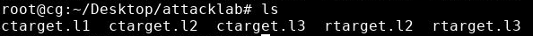
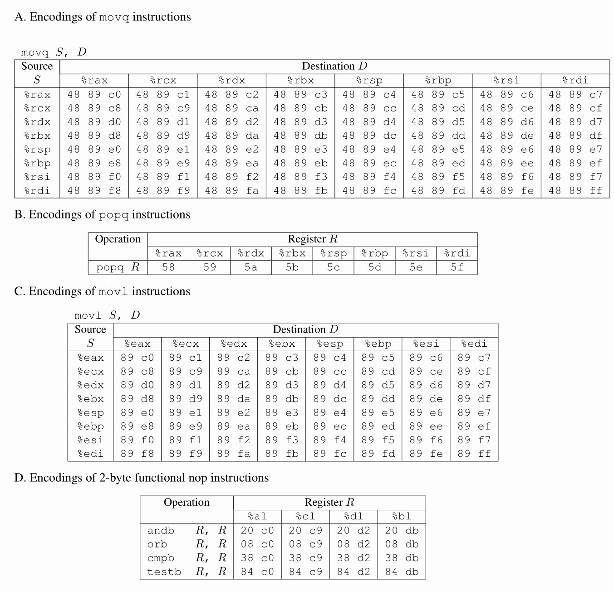

# Attack Lab

## 1. 实验步骤

### 1.1 第一步：获取初始文件

用git获取实验初始文件：

1. 在虚拟桌面左边窗口的上方点击“GitLab”。
2. “点击复制”按钮，复制git仓库地址。
3. 关闭上述界面，在左边窗口的上方点击“更多”，选择“剪切板“。
4. 在剪切板中ctrl+v贴入git仓库地址。
5. 关闭上述界面，在命令行界面中输入下述命令，你要把http地址替换成你的仓库地址，按照提示输入GitLab的用户名和密码：

```bash
git clone http://172.16.2.166/2020302111371/expProject2026-674.git csapp-attacklab
```

*csapp-attacklab*目录下包含如下文件：

- *README.txt*：描述本目录内容的文件。
- *ctarget*：一个容易遭受code-injection攻击的可执行程序。
- *rtarget*：一个容易遭受return-oriented-programming攻击的可执行程序。
- *cookie.txt*：一个8位的十六进制码，在后面解题会用到.
- *farm.c*：你的目标“gadget farm”的源代码，在产生return-oriented programming攻击时会用到。
- *hex2raw*：一个生成攻击字符串的工具。

### 1.2 要点说明

- 要在我们提供的实验平台上完成该实验，我们不保证在其他平台上作出的结果能在我们的验证平台上成功执行。
- 你的解答不能绕开程序中的验证代码。也就是说，*ret*指令使用的攻击字符串中注入的地址必须是一下几种之一：
    - 函数*touch1*，*touch2*或*touch3*的地址
    - 你注入的代码的地址
    - gadget farm中gadget的地址
- 只能从文件*rtarget*中地址范围在函数*start_farm*和*end_farm*之间的地址构造gadget。

### 1.3 提交评测

在桌面(*~/Desktop*)创建一个名为*attacklab*的目录。
把每一关的输入文件（二进制，即*hex2raw*处理后的输出）按照以下命名放入该目录：



然后点击“提交评测”按钮即可。

若只提交这5个文件中的其中几个，将只对这几个关卡进行评分。

### 1.4 代码存档

在所有的实验完成之后，在本地代码仓库所在目录下输入：

```bash
git add ctarget.l1 ctarget.l2 ctarget.l3 rtarget.l2 rtarget.l3
git commit -m "final version"
git push -u origin master
```

在第一次执行`git commit`时还要设置邮箱和姓名：


虚拟桌面左侧窗口中点击”GitLab“按钮，点击”提交GitLab仓库“按钮：


完成代码提交存档。

## 2 目标程序

*ctarget*和*rtarget*都是用*getbuf*函数从标准输入读入字符串，*getbuf*函数定义如下：

```c
unsigned getbuf()
{
    char buf[BUFFER_SIZE]; 
    Gets(buf); 
    return 1;
}
```

函数*Gets*类似于标准库函数*gets*，从标准输入读入一个字符串（以‘\n’或者*end-of-file*结束），将字符串（带*null*结束符）存储在指定的目的地址。从这段代码可以看出，目标地址是数组*buf*，声明为*BUFFERSIZE*个字节。*BUFFER_SIZE*是一个编译时常量，在你的*target*程序生成时就具体确定了。

函数*Gets*()和*gets*()都无法确定目标缓冲区是否够大，能够存储下读入的字符串。它们都只会简单地拷贝字节序列，可能会超出目标地址处分配的存储空间的边界。

如果用户输入和*getbuf*读入的字符串足够短，*getbuf*会返回1，如下执行示例所示：

```console
unix$ ./ctarget
Cookie: 0x5534d1f8
Type string:Keep it short!
No exploit. Getbuf returned 0x1
Normal return
```

如果你输入的字符串很长，就会出错：

```console
unix$ ./ctarget
Cookie: @x5534d1f8
Type string:This is not a very interesting string, but it has the property ... Ouch!: You caused a segmentation fault!
Ouch!: You caused a segmentation fault!
Better luck next time
FAILED
```

*rtarget*程序有类似的行为。正如错误消息提示的那样，超出缓冲区大小通常会导致程序状态被破坏，引起内存访问错误。你的任务是巧妙的设计输入给*ctarget*和*rtarget*的字符串，让它们做些更有趣的事情。这样的字符串称为攻击（exploit）字符串。

*ctarget*和*rtarget*有这样一些命令行参数：

```console
-h：输出可能的命令行参数列表
-i FILE：输入来自于文件FILE而不是标准输入
```

一般来说，你的攻击字符串包含的字节值并不都对应着能够打印出来的字符的ASCII值。*hex2raw*程序的使用见附录A。

要点说明：

- 你的攻击字符串不能包含字节值*0x0a*，这是换行符（’\n’）的ASCII代码。Gets遇到这个字节时会认为你意在结束该字符串。
- *hex2raw*要求输入的十六进制值必须是两位的，值与值之间以一个或多个空白分隔。如果你想得到一个十六进制值为0的字节，必须输入00。要得到字*0xdeadbeef*，必须向*hex2raw*输入“ef be ad de”（注意顺序相反是因为使用的是小端法字节序）。

本实验分为五个阶段，*ctarget*的三个使用的是CI（code-injection），*rtarget*的两个阶段使用的是ROP（return-oriented-programming），如下所示：

| 阶段 | 程序 | 关数 | 方法 | 函数 | 分数 |
| --- | --- | --- | --- | --- | --- |
| 1 | `ctarget` | 1 | CI | touch1 | 10 |
| 2 | `ctarget` | 2 | CI | touch2 | 25 |
| 3 | `ctarget` | 3 | CI | touch3 | 25 |
| 4 | `rtarget` | 2 | ROP | touch2 | 35 |
| 5 | `rtarget` | 3 | ROP | touch3 | 5 |

## 3 实验内容第一部分：代码注入攻击

前三个阶段，你的攻击字符串会攻击*ctarget*程序。程序被设置成栈的位置每次执行都一样，这样一来栈上的数据就可以等效于可执行代码。这使得程序更容易遭受包含可执行代码字节编码的攻击字符串的攻击。

### 3.1 第一关

在这一关中，你不用注入新的代码，你的攻击字符串要指引程序去执行一个已经存在的函数。

*ctarget*中函数*test*调用了函数*getbuf*，*test*的代码如下：

```c
void test()
{
    int val;
    val = getbuf(); 
    printf("No exploit.  Getbuf returned 0x%x\n", val);
}
```

*getbuf*执行返回语句时（*getbuf*的第5行），按照规则，程序会继续执行*test*函数中的语句，而我们想改变这个行为。在*ctarget*中，函数*touch1*的代码如下：

```c
void touch1()
{
    vlevel = 1;       /* Part of validation protocol */
    printf("Touch1!: You called touch1()\n");
    validate(1);
    exit(0);
}
```

你的任务是让*ctarget*在*getbuf*执行返回语句后执行*touch1*的代码。注意，你的攻击字符串可以破坏栈中不直接和本阶段相关的部分，这不会造成问题，因为*touch1*会使得程序直接退出。

要点说明：

- 设计本阶段的攻击字符串所需的信息都从检查*ctarget*的反汇编代码中获得。用`objdump -d`进行反汇编。
- 主要思路是找到*touch1*的起始地址的字节表示的位置，使得*getbuf*结尾处的*ret*指令会将控制转移到*touch1*。
- 注意字节顺序。
- 可能需要用*gdb*单步跟踪调试*getbuf*的最后几条指令，确保它按照你期望的方式工作。
- *buf*在*getbuf*栈帧中的位置取决于编译时常数*BUFFERSIZE*的值，以及*gcc*使用的分配策略。你需要检查反汇编带来来确定它的位置。

### 3.2 第二关

第二关中，你需要在攻击字符串中注入少量代码。

在*ctarget*中，函数*touch2*的代码如下：

```c
void touch2(unsigned val)
{
    vlevel = 2;       /* Part of validation protocol */
    if (val == cookie) {
        printf("Touch2!: You called touch2(0x%.8x)\n", val);
        validate(2);
    } else {
        printf("Misfire: You called touch2(0x%.8x)\n", val);
        fail(2);
    }
    exit(0);
}
```

你的任务是使*ctarget*执行*touch2*的代码而不是返回到*test*。在这个例子中，你必须让*touch2*以为它收到的参数是你的cookie。

建议：

- 需要确定你注入代码的地址的字节表示的位置，使*getbuf*代码最后的*ret*指令会将控制转移到那里。
- 注意，函数的第一个参数是放在寄存器%*rdi*中的。
- 你注入的代码必须将寄存器的值设定为你的cookie，然后利用*ret*指令将控制转移到*touch2*的第一条指令。
- 不要在攻击代码中使用*jmp*或*call*指令。所有的控制转移都要使用*ret*指令，即使实际上你并不是要从一个函数调用返回。
- 参见附录B学习如何生成指令序列的字节级表示。

### 3.3 第三关

第三阶段还是代码注入攻击，但是是要传递字符串作为参数。

*ctarget*文件中函数*hexmatch*和*touch3*的C代码如下：

```c
int hexmatch(unsigned val, char *sval)
{
    char cbuf[110];
    /* Make position of check string unpredictable */
    char *s = cbuf + random() % 100;
    sprintf(s, "%.8x", val);
    return strncmp(sval, s, 9) == 0;
}

void touch3(char *sval)
{
    vlevel = 3;       /* Part of validation protocol */
    if (hexmatch(cookie, sval)) {
        printf("Touch3!: You called touch3(\"%s\")\n", sval);
        validate(3);
    } else {
        printf("Misfire: You called touch3(\"%s\")\n", sval);
        fail(3);
    }
    exit(0);
}
```

你的任务是让*ctarget*执行*touch3*而不要返回到*test*。要使*touch3*以为你传递你的cookie的字符串表示作为它的参数。

建议：

- 你的攻击字符串中要包含你的cookie的字符串表示。这个字符串由8个十六进制数字组成（顺序是从最高位到最低位），开头没有“*0x*”。
- 注意，C中的字符串表示是一个字节序列，最后跟一个值为0的字节。`man ascii`能够找到你需要的字符的字节表示。
- 你的注入代码应该将寄存器%*rdi*设置为攻击字符串的地址。
- 调用*hexmatch*和*strncmp*函数时，会将数据压入栈中，覆盖*getbuf*使用的缓冲区的内存，你需要很小心把你的cookie字符串表示放在哪里。

## 4 实验内容第二部分：面向返回的编程

对程序*rtarget*进行代码注入攻击要难一些，它采用了以下两种技术对抗攻击：

- 采用了随机化，每次运行栈的位置都不同。所以无法决定你的注入代码应该放在哪里。
- 将保存栈的内存区域设置为不可执行，所以即使你能把注入的代码的起始地址放到程序计数器中，程序也会报段错误失败。

幸运的是，聪明的人们设计了一些策略，通过执行现有程序中的代码来做他们期望的事情，而不是注入新的代码。这种方法称为面向返回的编程（ROP）。

例如，*rtarget*可能包含如下代码：

```c
void setval_210(unsigned *p)
{
    *p = 3347663060U;
}
```

这个函数不太可能会攻击到一个系统，但是这段代码反汇编出来的机器代码是：

```assembly
0000000000400f15 <setval_210>:

  400f15:       c7 07 d4 48 89 c7       movl   $0xc78948d4,(%rdi)

  400f1b:       c3                      retq
```

字节序列48 49 c7是指令`movq %rax, %rdi`的编码。图2A展示了一些有用的*movq*指令的编码。你的*rtarget*的攻击代码由一组类似于*setval210*的函数组成，我们称为gadget farm。你的工作是从gadget farm中挑选出有用的gadget执行类似于前述第二关和第三关的攻击。

要点说明：

函数*start_farm*和*end_farm*之间的所有函数构成了你的gadget farm。不要用程序代码中的其他部分作为你的gadget。

### 4.1 第二关

在第四阶段，你将重复第二阶段的攻击，不过要使用gadget farm里的gadget来攻击*rtarget*程序。你的答案只使用如下指令类型的gadget，也只能使用前八个x86-64寄存器（%rax-%rdi）。

*movq*：代码如图2A所示。

*popq*；代码如图2B所示。

*ret*：该指令编码为0xc3。

*nop*：该指令编码为0x90。

建议：

- 只能用两个gadget来实现该次攻击。
- 如果一个gadget使用了*popq*指令，那么它会从栈中弹出数据。这样一来，你的攻击代码能既包含gadget的地址也包含数据。



图2. 指令的字节编码。所有的值均为十六进制。

### 4.2 第三关

阶段五要求你对*rtarget*程序进行ROP攻击，用指向你的cookie字符串的指针，使程序调用*touch3*函数。

这一关，允许你使用函数*start_farm*和*end_farm*之间的所有gadget。除了第四阶段允许的那些指令，还允许使用*movl*指令（如图2C所示），以及图2D中的2字节指令，它们可以作为有功能的*nop*，不改变任何寄存器或内存的值，例如，`andb %al, %al`，这些指令对寄存器的低位字节做操作，但是不改变它们的值。

提示：

- 官方答案需要8个gadgets。

## 附录A *hex2raw*的使用

*hex2raw*的输入是一个十六进制格式的字符串，用两个十六进制数字表示一个字节值。例如，字符串“012345”，必须输入“30 31 32 33 34 35 00”。十六进制字符之间以空白符（空格或新行）分隔。

可以把攻击字符串存入文件中，例如*exploit.txt*，以下列几种方式调用：

1. 用一系列管道（pipe）通过*hex2raw*传递字符串。

```console
unix> cat exploit.txt | ./hex2raw | ./ctarget
```

2. 将raw字符串存在文件中，使用I/O重定向。

```console
unix> ./hex2raw < exploit.txt > exploit-raw.txt
unix> ./ctarget < exploit-raw.txt
```

这种方法也可以在*gdb*中使用。

```console
unix> gdb ctarget
(gdb) run < exploit-raw.txt
```

3. 将raw字符串存在文件中，将文件的名字作为*hex2raw*的命令行参数。

```console
unix> ./hex2raw < exploit.txt > exploit-raw.txt
unix> ./ctarget -i exploit-raw.txt
```

这种方法也可以在*gdb*中使用。

## 附录B 生成字节代码

假设编写一个汇编文件*example.s*，代码如下：

```assembly
# Example of hand-generated assembly code
pushq   $0xabcdef             # Push value onto stack
addq    $17,%rax              # Add 17 to %rax
movl    %eax,%edx             # Copy lower 32 bits to %edx
```

可以汇编和反汇编文件：

```console
unix> gcc -c example.s
unix> objdump -d example.o > example.d
```

生成的*example.d*包含如下内容：

```assembly
example.o: file format elf64-x86-64
Disassembly of section .text:
0000000000000000 <.text>:
   0: 68 ef cd ab 00             pushq  $0xabcdef
   5: 48 83 c0 11                add    $0x11,%rax
   9: 89 c2                      mov    %eax,%edx
```

由此可以推出这段代码的字节序列：

`68 ef cd ab 00 48 83 c0 11 89 c2`

可以通过*hex2raw*生成目标程序的输入字符串。也可以手动修改*example.d*的代码，得到下面的内容：

```assembly
   68 ef cd ab 00   /* pushq  $0xabcdef  */
   48 83 c0 11     /* add    $0x11,%rax */
   89 c2          /* mov    %eax,%edx  */
```

这也是合法的*hex2raw*的输入。

> 重要的文件建议保存在工作路径：`/mnt/hgshare`下，如果容器出现故障，桌面还原之后，点击“更多”/“工作目录文件浏览”找回。