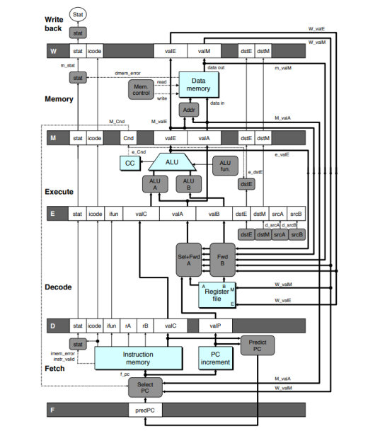
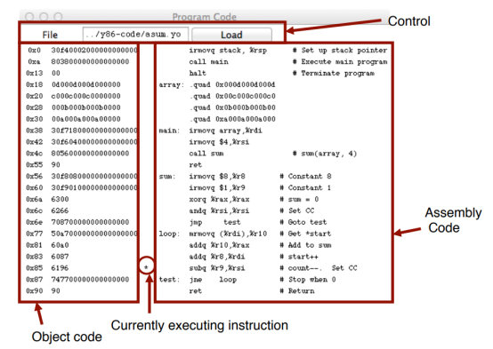
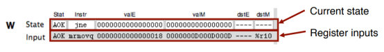

# CS:APP3e Guide to Y86-64 Processor Simulators



This document describes the processor simulators that accompany the presentation of the Y86-64 processor architectures in Chapter 4 of Computer Systems: A Programmer’s Perspective, Third Edition. These simulators model three different processor designs: SEQ, SEQ+, and PIPE.

## 1 Installing

The code for the simulator is distributed as a tar format file named sim.tar. You can get a copy of this file from the CS:APP3e Web site (csapp.cs.cmu.edu).

With the tar file in the directory you want to install the code, you should be able to do the following:

```bash
linux> tar xf sim.tar
linux> cd sim
linux> make clean
linux> make
```

By default, this generates GUI (graphic user interface) versions of the simulators, which require that you have Tcl/Tk installed on your system. If not, then you have the option to install TTY-only versions that emit their output as ASCII text on stdout. See file README for a description of how to generate the GUI and TTY versions.

The directory `sim` contains the following subdirectories:

- `misc` Source code files for utilities such as YAS (the Y86-64 assembler), YIS (the Y86-64 instruction set simulator), and HCL2C (HCL to C translator). It also contains the `isa.c` source file that is used by all of the processor simulators.
- `seq` Source code for the SEQ and SEQ+ simulators. Contains the HCL file for homework problem 4.52. See file README for instructions on compiling the different versions of the simulator.
- `pipe` Source code for the PIPE simulator. Contains the HCL files for homework problems 4.54–4.58. See file README for instructions on compiling the different versions of the simulator.
- `y86-code` Y86-64 assembly code for many of the example programs shown in the chapter. You can automatically test your modified simulators on these benchmark programs. See file README for instructions on how to run these tests. As a running example, we will use the program `asum.ys` in this subdirectory. This program is shown as CS:APP3e Figure 4.7. The compiled version of the program is shown in Figure 1.
- `ptest` Scripts that generate systematic regression tests of the different instructions, the different jump possibilities, and different hazard possibilities. These scripts are very good at finding bugs in your homework solutions. See file README for instructions on how to run these tests.

```assembly
1                              | # Execution begins at address 0
2  0x000:                      |   .pos 0
3  0x000: 30f40002000000000000 |   irmovq stack, %rsp      # Set up stack pointer
4  0x00a: 803800000000000000   |   call main               # Execute main program
5  0x013: 00                   |   halt                    # Terminate program
6                              | 
7                              | # Array of 4 elements
8  0x018:                      |   .align 8
9  0x018: 0d000d000d000000     | array:  .quad 0x000d000d000d
10 0x020: c000c000c0000000     |         .quad 0x00c000c000c0
11 0x028: 000b000b000b0000     |         .quad 0x0b000b000b00
12 0x030: 00a000a000a00000     |         .quad 0xa000a000a000
13                             | 
14 0x038: 30f71800000000000000 | main:   irmovq array,%rdi
15 0x042: 30f60400000000000000 |         irmovq $4,%rsi
16 0x04c: 805600000000000000   |         call sum            # sum(array, 4)
17 0x055: 90                   |         ret
18                             | 
19                             | # long sum(long *start, long count)
20                             | # start in %rdi, count in %rsi
21 0x056: 30f80800000000000000 | sum:    irmovq $8,%r8       # Constant 8
22 0x060: 30f90100000000000000 |         irmovq $1,%r9       # Constant 1
23 0x06a: 6300                 |         xorq %rax,%rax      # sum = 0
24 0x06c: 6266                 |         andq %rsi,%rsi      # Set CC
25 0x06e: 708700000000000000   |         jmp test            # Goto test
26 0x077: 50a70000000000000000 | loop:   mrmovq (%rdi),%r10  # Get *start
27 0x081: 60a0                 |         addq %r10,%rax      # Add to sum
28 0x083: 6087                 |         addq %r8,%rdi       # start++
29 0x085: 6196                 |         subq %r9,%rsi       # count--. Set CC
30 0x087: 747700000000000000   | test:   jne loop            # Stop when 0 #
31 0x090: 90                   |         ret                 # Return
32                             | 
33                             | # Stack starts here and grows to lower addresses
34 0x200:                      |         .pos 0x200
35 0x200:                      | stack:
```

**Figure 1: Sample object code file. This code is in the file `asum.yo` in the `y86-code` subdirectory.**

## 2 Utility Programs

Once installation is complete, the `misc` directory contains two useful programs:

**YAS** The Y86-64 assembler. This takes a Y86-64 assembly code file with extension `.ys` and generates a file with extension `.yo`. The generated file contains an ASCII version of the object code, such as that shown in Figure 1 (The same program as shown in CS:APP3e Figure 4.8 with slightly different formatting.) The easiest way to invoke the assembler is to use or create assembly code files in the `y86-code` subdirectory. For example, to assemble the program in file `asum.ys` in this directory, we use the command:

```bash
linux> make asum.yo
```

**YIS** The Y86-64 instruction simulator. This program executes the instructions in a Y86-64 machine-level program according to the instruction set definition. For example, suppose you want to run the program `asum.yo` from within the subdirectory `y86-code`. Simply run:

```bash
linux> ../misc/yis asum.yo
```

YIS simulates the execution of the program and then prints changes to any registers or memory locations on the terminal, as described in CS:APP3e Section 4.1.

## 3 Processor Simulators

For the three processors, SEQ, SEQ+, and PIPE, we have provided simulators SSIM, SSIM+, and PSIM respectively. Each simulator can be run in TTY or GUI mode:

- **TTY mode** Uses a minimalist, terminal-oriented interface. Prints everything on the terminal output. Not very convenient for debugging but can be installed on any system and can be used for automated testing. The default mode for all simulators.
- **GUI mode** Has a graphic user interface, to be described shortly. Very helpful for visualizing the processor activity and for debugging modified versions of the design. Requires installation of Tcl/Tk on your system. Invoked with the `-g` command line option. Running in GUI mode is only possible from within the directory (`pipe` or `seq`) in which the executable simulator program is located.

### 3.1 Simulator Command Line Options

For all three simulators, you can specify several options from the command line:

- `-h` Prints a summary of all of the command line options.
- `-g` Run the simulator in GUI mode (the default is TTY mode).
- `-t` (TTY mode only) Runs both the processor and the ISA simulators, comparing the resulting values of the memory, register file, and condition codes. If no discrepancies are found, it prints the message “ISA Check Succeeds.” Otherwise, it prints information about the words of the register file or memory that differ. This feature is very useful for testing the processor designs.
- `-l m` (TTY mode only) Sets the instruction limit, executing at most m instructions before halting (the default limit is 10000 instructions).
- `-v n` (TTY mode only) Sets the verbosity level to n, which must be between 0 and 2 with a default value of 2.

Simulators running in GUI mode must be invoked with the name of an object file on the command line. In TTY mode, the object file name is optional, coming from stdin by default. Here are some typical invocations of the simulators from within the `seq` subdirectory:

```bash
linux> ./ssim -h
linux> ./ssim+ -t < ../y86-code/asum.yo
linux> ./ssim -g ../y86-code/asum.yo
```

The first case prints a summary of the command line options for SSIM. The second case runs SSIM+ in TTY mode, reading object file `asum.yo` from stdin. The resulting register and memory values are compared with those from the higher-level ISA simulator. The third case runs SSIM in GUI mode, executing the instructions in object code file `asum.yo` from the `y86-code` subdirectory. The same invocations would work for the PIPE simulator PSIM from within the `pipe` subdirectory.

### 3.2 GUI Version of SEQ Simulator

The GUI version of the SEQ processor simulator is invoked from within the `seq` subdirectory with an object code filename on the command line:

```bash
linux> ./ssim -g ../y86-code/asum.yo &
```

where the “&” at the end of the command line allows the simulator to run in background mode. The simulation program starts up and creates three windows, as illustrated in Figures 2–4.

The first window (Figure 2) is the main control panel. If the HCL file was compiled by HCL2C with the `-n name` option, then the title of the main control window will appear as “Y86-64 Processor: name” Otherwise it will appear as simply “Y86-64 Processor.”

The main control window contains buttons to control the simulator as well as status information about the state of the processor. The different parts of the window are labeled in the figure:

**Control:** The buttons along the top control the simulator. Clicking the **Quit** button causes the simulator to exit. Clicking the **Go** button causes the simulator to start running. Clicking the **Stop** button causes the simulator to stop temporarily. Clicking the **Step** button causes the simulator to execute one instruction and then stop. Clicking the **Reset** button causes the simulator to return to its initial state, with the program counter at address 0, the registers set to zeros, the memory erased except for the program, the condition codes set with $ZF = 1$, $CF = 0$, and $OF = 0$, and the program status set to AOK. The slider below the buttons controls the speed of the simulator when it is running. Moving it to the right makes the simulator run faster.


**Figure 2: Main control panel for SEQ simulator**



**Figure 3: Code display window for SEQ simulator**


**Figure 4: Memory display window for SEQ simulator**

**Stage values:** This part of the display shows the values of the different processor signals during the current instruction evaluation. These signals are almost identical to those shown in CS:APP3e Figure 4.23. The main difference is that the simulator displays the name of the instruction in a field labeled **Instr**, rather than the numeric values of `icode` and `ifun`. Similarly, all register identifiers are shown using their names, rather than their numeric values, with “----” indicating that no register access is required.

**Register file:** This section displays the values of the 15 program registers. The register that has been updated most recently is shown highlighted in light blue. Register contents are not displayed until after the first time they are set to nonzero values. Remember that when an instruction writes to a program register, the register file is not updated until the beginning of the next clock cycle. This means that you must step the simulator one more time to see the update take place.

**Stat:** This shows the status of the current instruction being executed. The possible values are:

- **AOK:** No problem encountered.
- **ADR:** An addressing error has occurred either trying to read an instruction or trying to read or write data. Addresses cannot exceed `0x0FFF`.
- **INS:** An illegal instruction was encountered.
- **HLT:** A halt instruction was encountered.

**Condition codes:** These show the values of the three condition codes: ZF, SF, and OF.

Remember that when an instruction changes the condition codes, the condition code register is not updated until the beginning of the next clock cycle. This means that you must step the simulator one more time to see the update take place.

The processor state illustrated in Figure 2 is for the first execution of line 29 of the `asum.yo` program shown in Figure 1. We can see that the program counter is at `0x085`, that it has processed the instruction `addq %r8, %rdi`, that register `%rax` holds `0xd000d000d`, the sum of the first array element, and `%rsi` holds 4, the count that is about to be decremented. Register `%rdi` holds `0x020`, the address of the second array element. There is a pending write of `0x03` to register `%rsi` (since `dstE` is set to `%rsi` and `valE` is set to `0x03`). This write will take place at the start of the next clock cycle.

The window depicted in Figure 3 shows the object code file that is being executed by the simulator. The edit box identifies the file name of the program being executed. You can edit the file name in this window and click the **Load** button to load a new program. The left hand side of the display shows the object code being executed, while the right hand side shows the text from the assembly code file. The center has an asterisk (*) to indicate which instruction is currently being simulated. This corresponds to line 29 of the `asum.yo` program shown in Figure 1.

The window shown in Figure 4 shows the contents of the memory. It shows only those locations between the minimum and maximum addresses that have changed since the program began executing. Each row shows the contents of two memory words. Thus, each row shows 16 bytes of the memory, where the addresses of the bytes differ in only their least significant hexadecimal digits. To the left of the memory values is the “root” address, where the least significant digit is shown as “-”. Each column then corresponds to words with least significant address digits `0x0`, and `0x8`. The example shown in Figure 4 has arrows indicating memory locations `0x01f0` and `0x01f8`.

The memory contents illustrated in the figure show the stack contents of the `asum.yo` program shown in Figure 1 during the execution of the `sum` procedure. Looking at the stack operations that have taken place so far, we see that `%rsp` was initialized to `0x200` (line 3). The call to `main` on line 4 pushes the return pointer `0x013`, which is written to address `0x01f8`. Procedure `main` calls `sum` (line 16), causing the return pointer `0x055` to be written to address `0x01f0`. That accounts for all of the words shown in this memory display, and for the stack pointer being set to `0x01f0`.

### 3.3 PIPE Simulator

The PIPE simulator also generates three windows. Figure 5 shows the control panel. It has the same set of controls, and the same display of the register file, status, and condition codes. The middle section shows the state of the pipeline registers. The different fields correspond to those in CS:APP3e Figure 4.52. At the bottom of this panel is a display showing the number of cycles that have been simulated (not including the initial cycles required to get the pipeline flowing), the number of instructions that have completed, and the resulting CPI.


**Figure 5: Main control panel for PIPE simulator**



**Figure 6: View of single pipe register in control panel for PIPE simulator**

As illustrated in the close-up view of Figure 6, each pipeline register is displayed with two parts. The upper values in white boxes show the current values in the pipeline register. The lower values with a gray background show the inputs to pipeline register. These will be loaded into the register on the next clock cycle, unless the register bubbles or stalls.

The flow of values through the PIPE simulator is quite different from that for the SEQ simulator. With SEQ, the control panel shows the values resulting from executing a single instruction. Each step of the simulator performs one complete instruction execution. With PIPE, the control panel shows the values for the multiple instructions flowing through the pipeline. Each step of the simulator performs just one stage’s worth of computation for each instruction.

Figure 7 shows the code display for the PIPE simulator. The format is similar to that for SEQ, except that rather than a single marker indicating which instruction is being executed, the display indicates which instructions are in each stage of the pipeline, using characters F, D, E, M, and W, for the fetch, decode, execute, memory, and write-back stages.


**Figure 7: Code display window for PIPE simulator**

The PIPE simulator also generates a window to display the memory contents. This has an identical format to the one shown for SEQ (Figure 4).

The example shown in Figures 5 and 7 show the status of the pipeline when executing the loop in lines 26–30 of Figure 1. We can see that the simulator has begun the first iteration of the loop, having entered the loop by jumping to the test portion (line 30). The status of the stages is as follows:

**Write back:** The `jne` instruction (line 30) of the initial test is finishing.

**Memory:** The `mrmovq` instruction (line 26) has just read `0x0D000D000D` from address `0x018`. We can see the address in `valE` of pipeline register M, and the value read from memory at the input of `valM` to pipeline register W.

**Execute:** This stage contains a bubble. The bubble was inserted due to the load-use dependency between the `mrmovq` instruction (line 26) and the `addq` instruction (line 27). It can be seen that this bubble acts like a `nop` instruction. This explains why there is no instruction in Figure 7 labeled with “E.”

**Decode:** The `addq` instruction (line 27) has just read `0x0` from register `%rax`. It also read `0x00D` from register `%r10`, but we can see that the forwarding logic has instead used the value `0x0D000D000D` that has just been read from memory (seen as the input to `valM` in pipeline register W) as the new value of `valA` (seen as the input to `valA` in pipeline register E).

**Fetch:** An `addq` instruction (line 28) has just been fetched from address `0x083`. The new value of the PC is predicted to be `0x085`.

Associated with each stage is its status field **Stat**. This field shows the status of the instruction in that stage of the pipeline. Status **AOK** means that no exception has been encountered. Status value **BUB** indicates that a bubble is in this stage, rather than a normal instruction. Other possible status values are: **ADR** when an invalid memory location is referenced, **INS** when an illegal instruction code is encountered, **PIP** when a problem arose in the pipeline (this occurs when both the stall and the bubble signals for some pipeline register are set to 1), and **HLT** when a halt instruction is encountered. The simulator will stop when any of these last four cases reaches the write-back stage.

Carrying the status for an individual instruction through the pipeline along with the rest of the information about that instruction enables precise handling of the different exception conditions, as described in CS:APP3e Section 4.5.6.

## 4 Some Advice

The following are some miscellaneous tips, learned from experience we have gained in using these simulators.

- Get familiar with the simulator operation. Try running some of the example programs in the `y86-code` directory. Make sure you understand how each instruction gets processed for some small examples. Watch for interesting cases such as mispredicted branches, load interlocks, and procedure returns.
- You need to hunt around for information. Seeing the effect of data forwarding is especially tricky. There are seven possible sources for signal `valA` in pipeline register E, and six possible sources for signal `valB`. To see which one was selected, you need to compare the input to these pipeline register fields to the values of the possible sources. The possible sources are:
    - `R[d_srcA]` The source register is identified by the input to `srcA` in pipeline register E. The register contents are shown at the bottom.
    - `R[d_srcB]` The source register is identified by the input to `srcB` in pipeline register E. The register contents are shown at the bottom.
    - `D_valP` This value is part of the state of pipeline register D.
    - `e_valE` This value is at the input to field `valE` in pipeline register M.
    - `M_valE` This value is part of the state of pipeline register M.
    - `m_valM` This value is at the input to field `valM` in pipeline register W.
    - `W_valE` This value is part of the state of pipeline register W.
    - `W_valM` This value is part of the state of pipeline register M.
- Do not overwrite your code. Since the data and code share the same address space, it is easy to have a program overwrite some of the code, causing complete chaos when it attempts to execute the overwritten instructions. It is important to set up the stack to be far enough away from the code to avoid this.
- Avoid large address values. The simulators do not allow any addresses greater than `0x0FFF`. In addition, the memory display becomes unwieldy if you modify memory locations spanning a wide range of addresses.
- Be aware of some “features” of the GUI-mode simulators (SSIM, SSIM+, and PSIM.)
    - You must must execute the programs from their home directories. In other words, to run SSIM or SSIM+, you must be in the `seq` directory, while you must be in the `pipe` subdirectory to run PSIM. This requirement arises due to the way the Tcl interpreter locates the configuration file for the simulator.
    - If you are running in GUI mode on a Unix box, remember to initialize the DISPLAY environment variable:
      `unix> setenv DISPLAY myhost.edu:0`
    - With some Unix X Window managers, the “Program Code” window begins life as a closed icon. If you don’t see this window when the simulator starts, you’ll need to expand the expand manually by clicking on it.
    - With some Microsoft Windows X servers, the “Memory Contents” window does not automatically resize itself when the memory contents change. In these cases, you’ll need to resize the window manually to see the memory contents.
    - The simulators will terminate with a segmentation fault if you ask them to execute a file that is not a valid Y86-64 object file.
