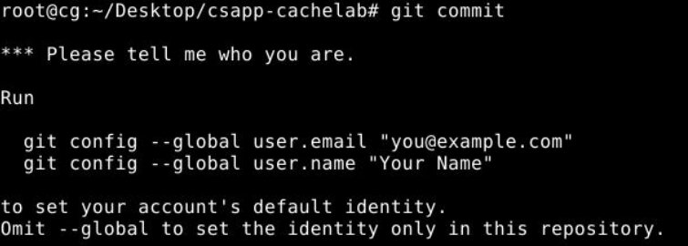
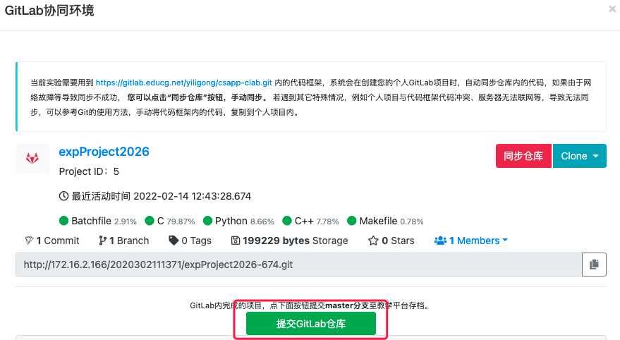

## 简介

**独立完成本实验!**

本实验将帮助你理解cache对C语言程序性能的影响。实验的第二部分Part B要求你优化一个小的矩阵转置函数，目标是尽量降低cache不命中次数。

## 实验描述

在Part B中，你要在 *trans.c* 文件中完成一个矩阵转置函数，使其cache miss尽可能的少。

设 $A$ 表示一个矩阵，$A_{ij}$ 表示位于第 $i$ 行和第 $j$ 列第元素，$A$ 的转置矩阵，表示为 $A^T$，有 $A_{ij}=A_{ji}^T$。

为了帮助你顺利开始，在 *trans.c* 中给出了一个转置矩阵的例子，它计算 $N \times M$ 的矩阵 $A$ 的转置，并将结果存放在 $M \times N$ 的矩阵 $B$ 中：

```c
char trans_desc[] = ”Simple row-wise scan transpose”;
void trans(int M, int N, int A[N][M], int B[M][N])
```

这个示例转置函数是正确的，但是效率并不高，因为它对数据的访问模式会引起很多的cache miss。

你在Part B中的工作就是要写一个类似的函数，称为 *transpose_submit*，对不同大小的矩阵都要尽可能的减少cache miss数量：

```c
char transpose_submit_desc[] = ”Transpose submission”;
void transpose_submit(int M, int N, int A[N][M], int B[M][N]);
```

**不要改动 *transpose_submit* 函数中的描述字符串“Transpose submission”**，自动评测程序会搜索这个字符串来确定待评测的转置函数。

## Part B的编程规则

- 在 *trans.c* 开头的注释中写上你的姓名和学号
- *trans.c* 的编译必须没有warnings，否则不能评测给分
- 每个转置函数中最多使用12个局部变量（这个限制是由于我们的测试程序不能统计对栈上数据的访问，所以希望你能限制对栈的访问，将改进注意力主要放在对源数组和目标数组的访问模式上）
- 不可以耍花招来规避上述规则，例如使用 *long* 类型或位运算把多个值打包进一个变量中
- 你的转置函数不可以使用递归
- 如果你的转置函数中调用了其他函数，那么在一个时刻，栈上不能有超过12个局部变量。例如，你的转置函数声明了8个变量，然后调用了一个函数，该函数声明了4个变量，这个函数又调用了一个声明了2个变量的函数，此时栈上一共有14个变量，你就违反了前述规则。
- 你的转置函数不能修改数组 $A$，不过你可以随意处置数组 $B$ 的内容
- 在你的代码中不能定义任何数组，或使用 *malloc* 或其变种

## 评测

本部分介绍我们会如何评测你的工作。Part B的满分为45分。我们要评测你的 *transpose_submit* 函数在不同大小矩阵上的正确性和性能：

- $32 \times 32 (M=32, N=32)$
- $64 \times 64 (M=64, N=64)$
- $61 \times 67 (M=61, N=67)$

对于每个矩阵大小，我们会用 *valgrind* 提取出你的 *transpose_submit* 函数访存地址，然后用参数 $s=5$，$E=1$，$b=5$ 来运行参考模拟器，回放这个trace。

对于每组矩阵大小，你的性能分根据miss数量m，在两个阈值之间线性计分：

- $32 \times 32$: 若 $m < 300$，得15分，若 $m > 600$，则为0分
- $64 \times 64$: 若 $m < 1,300$，得15分, 若 $m > 2,000$ ，则为0分
- $61 \times 67$: 若 $m < 2,000$，得15分，若 $m > 3,000$，则为0分

我们只会对这三组用例进行测试，所以你要确保代码对这些测试用例的正确性，并可以专门针对它们做优化。比如，你可以检查输入的大小，然后分别采用不同的优化策略。

## 实验内容

我们提供了一个自动评测程序，*test-trans.c*，向自动评测程序注册你在 *trans.c* 中实现的转置函数，最多可以注册100个版本。每个转置函数都有如下形式：

```c
/* Header comment */
char trans_simple_desc[] = "A simple transpose";
void trans_simple(int M, int N, int A[N][M], int B[M][N])
{
	/* your transpose code here */  
}
```

向自动评测程序注册转置函数就是在 *trans.c* 中的 *registerFunctions* 函数中做如下形式的调用：

`registerTransFunction(transpose_simple, transpose_simple_desc); `

运行时，自动评测程序会评测每个注册了的转置函数，并打印出结果。当然，其中要包括最后要提交给我们评测的函数：

`registerTransFunction(transpose_submit, transpose_submit_desc);`

你可以看看我们提供的缺省的转置函数，理解这个机制是如何工作的。

自动评测程序以一个矩阵大小作为输入，再使用 *valgrind* 生成每个注册的转置函数的trace。然后在一个参数为 $s=5$，$E=1$，$b=5$ 的cache上运行参考模拟器，评测每个trace的性能。

例如，要验证你的转置函数在 $32 \times 32$ 的矩阵上的性能，我们要重新 *build test-trans*，然后用对应的 $M$ 和 $N$ 值来运行它：

```bash
linux> make
linux> ./test-trans -M 32 -N 32
Step 1: Evaluating registered transpose funcs for correctness:
func 0 (Transpose submission): correctness: 1
func 1 (Simple row-wise scan transpose): correctness: 1
func 2 (column-wise scan transpose): correctness: 1
func 3 (using a zig-zag access pattern): correctness: 1

Step 2: Generating memory traces for registered transpose funcs.

Step 3: Evaluating performance of registered transpose funcs (s=5, E=1, b=5)
func 0 (Transpose submission): hits:1766, misses:287, evictions:255
func 1 (Simple row-wise scan transpose): hits:870, misses:1183, evictions:1151
func 2 (column-wise scan transpose): hits:870, misses:1183, evictions:1151
func 3 (using a zig-zag access pattern): hits:1076, misses:977, evictions:945

Summary for official submission (func 0): correctness=1 misses=287
```

在上面这个例子中，我们在 *trans.c* 中注册了4个不同的转置函数。*test-trans* 程序会依次检查每个注册了的函数，展示每个函数的结果，抽取出最后提交版本的结果。

对于Part B，我们给你一些提示：

- *test-trans* 程序将函数 $i$ 的trace保存在文件 *trace.fi* 中（*valgrind* 会记录很多与你的代码无关的、对栈的访问，在trace文件中我们过滤掉了所有的栈访问。这就是为什么我们不允许你声明局部数组并限制局部变量数量的原因。）这些trace文件能帮助你理解每个转置函数的hit和miss都是哪里来的，是帮助调试的好工具。要调试某个特定的函数，就在这个trace上运行参考模拟器，带上详细信息选项：

```bash
linux> ./csim-ref -v -s 5 -E 1 -b 5 -t trace.f0
S 68312c,1 miss 
L 683140,8 miss 
L 683124,4 hit 
L 683120,4 hit 
L 603124,4 miss eviction 
S 6431a0,4 miss 
...
```

- 我们是在一个直接映射的cache上评测你的转置函数，所以conflict miss可能是个问题。思考你的代码中的conflict miss，特别是沿着对角线的。想想什么样的访问模式能降低这些conflict miss的数量。

- 分块是一个降低cache miss的有效方法。可以参考课堂ppt，也可以参考 [http://csapp.cs.cmu.edu/public/waside/waside-blocking.pdf](http://csapp.cs.cmu.edu/public/waside/waside-blocking.pdf) 这篇文章。（没有翻译版本提供。^_^）

## 实验评测

本实验采用在线评测方式。

将你实现的 *trans.c* 文件拷贝到桌面上，点击终端界面上的“提交评测”，会得到并提交你的实验评分。

**你还需要写一个实验报告**，*csapp-cachelab* 目录中有一个文件 *report.md*，给出了实验报告的模版。你需要修改该文件，说明你提交的转置函数是如何针对三种矩阵大小进行了何种优化的，优化效果如何。欢迎你写出你尝试过的所有优化策略，比较它们的效果以及分析效果优劣的原因。

本实验报告用Markdown格式撰写，Markdown的语法可以参见 [GFM基础书写格式](https://cslabcg.whu.edu.cn/help/markdownguide.html) 。

## 代码存档

在所有的实验完成之后，在本地代码仓库所在目录下输入：

```bash
git add trans.c
git commit -m "final version"
git push -u origin master
```

在第一次执行 `git commit` 时还要设置邮箱和姓名：



虚拟桌面左侧窗口中点击”GitLab“按钮，点击”提交GitLab仓库“按钮：



完成**代码和实验报告**提交存档。