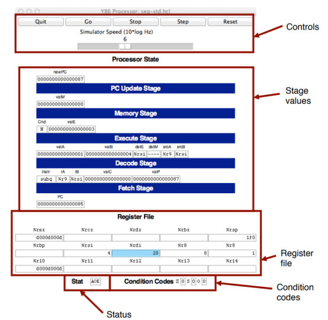
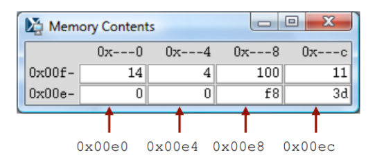
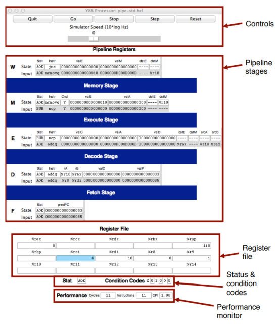
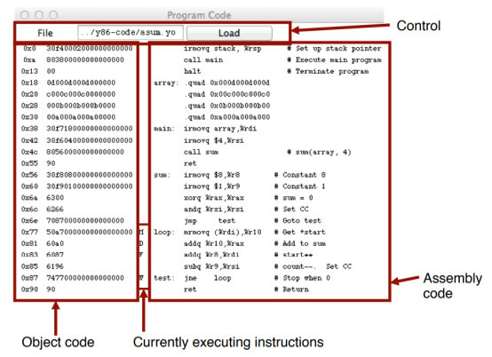

# CS:APP3e Y86-64 处理器模拟器指南


本文档描述了配合 *Computer Systems: A Programmer’s Perspective, Third Edition* (CS:APP3e) 第 4 章中 Y86-64 处理器体系结构演示的处理器模拟器。这些模拟器模拟了三种不同的处理器设计：SEQ、SEQ+ 和 PIPE。

> [!NOTE]
> **译者注：** 本文档旨在提供更清晰流畅的中文阅读体验。对于关键术语，将保留或标注英文以便对照。

## 1 安装 (Installing)

模拟器的代码以名为 `sim.tar` 的 tar 格式文件分发。你可以从 CS:APP3e 网站 (csapp.cs.cmu.edu) 获取此文件的副本。

将 tar 文件放在你想要安装代码的目录下，你应该可以执行以下操作：

```bash
linux> tar xf sim.tar
linux> cd sim
linux> make clean
linux> make
```

默认情况下，这将生成模拟器的 GUI（图形用户界面）版本，这要求你的系统上安装了 Tcl/Tk。如果没有安装，你可以选择安装仅 TTY 版本，它们将输出作为 ASCII 文本输出到标准输出 (stdout)。有关如何生成 GUI 和 TTY 版本的说明，请参阅 `README` 文件。

`sim` 目录包含以下子目录：

*   `misc`: 实用程序的源代码文件，例如 YAS（Y86-64 汇编器）、YIS（Y86-64 指令集模拟器）和 HCL2C（HCL 到 C 转换器）。它还包含所有处理器模拟器使用的 `isa.c` 源文件。
*   `seq`: SEQ 和 SEQ+ 模拟器的源代码。包含家庭作业问题 4.52 的 HCL 文件。有关编译不同版本模拟器的说明，请参阅 `README` 文件。
*   `pipe`: PIPE 模拟器的源代码。包含家庭作业问题 4.54–4.58 的 HCL 文件。有关编译不同版本模拟器的说明，请参阅 `README` 文件。
*   `y86-code`: 章节中展示的许多示例程序的 Y86-64 汇编代码。你可以在这些基准程序上自动测试你修改后的模拟器。有关如何运行这些测试的说明，请参阅 `README` 文件。作为一个贯穿始终的示例，我们将使用此子目录中的程序 `asum.ys`。该程序展示于 CS:APP3e 图 4.7。程序的编译版本如图 1 所示。
*   `ptest`: 生成系统回归测试的脚本，测试不同的指令、不同的跳转可能性和不同的冒险可能性。这些脚本非常擅长发现家庭作业解决方案中的错误。有关如何运行这些测试的说明，请参阅 `README` 文件。

```assembly
1                              | # Execution begins at address 0
2  0x000:                      |   .pos 0
3  0x000: 30f40002000000000000 |   irmovq stack, %rsp      # Set up stack pointer
4  0x00a: 803800000000000000   |   call main               # Execute main program
5  0x013: 00                   |   halt                    # Terminate program
6  0x018:                      | 
7                              | # Array of 4 elements
8  0x018:                      |   .align 8
9  0x018: 0d000d000d000000     | array:  .quad 0x000d000d000d
10 0x020: c000c000c0000000     |         .quad 0x00c000c000c0
11 0x028: 000b000b000b0000     |         .quad 0x0b000b000b00
12 0x030: 00a000a000a00000     |         .quad 0xa000a000a000
13                             | 
14 0x038: 30f71800000000000000 | main:   irmovq array,%rdi
15 0x042: 30f60400000000000000 |         irmovq $4,%rsi
16 0x04c: 805600000000000000   |         call sum            # sum(array, 4)
17 0x055: 90                   |         ret
18                             | 
19                             | # long sum(long *start, long count)
20                             | # start in %rdi, count in %rsi
21 0x056: 30f80800000000000000 | sum:    irmovq $8,%r8       # Constant 8
22 0x060: 30f90100000000000000 |         irmovq $1,%r9       # Constant 1
23 0x06a: 6300                 |         xorq %rax,%rax      # sum = 0
24 0x06c: 6266                 |         andq %rsi,%rsi      # Set CC
25 0x06e: 708700000000000000   |         jmp test            # Goto test
26 0x077: 50a70000000000000000 | loop:   mrmovq (%rdi),%r10  # Get *start
27 0x081: 60a0                 |         addq %r10,%rax      # Add to sum
28 0x083: 6087                 |         addq %r8,%rdi       # start++
29 0x085: 6196                 |         subq %r9,%rsi       # count--. Set CC
30 0x087: 747700000000000000   | test:   jne loop            # Stop when 0 #
31 0x090: 90                   |         ret                 # Return
32                             | 
33                             | # Stack starts here and grows to lower addresses
34 0x200:                      |         .pos 0x200
35 0x200:                      | stack:
```

**图 1: 示例目标代码文件。此代码位于 `y86-code` 子目录下的 `asum.yo` 文件中。**

## 2 实用程序 (Utility Programs)

安装完成后，`misc` 目录包含两个有用的程序：

**YAS**: Y86-64 汇编器。它接受扩展名为 `.ys` 的 Y86-64 汇编代码文件，并生成扩展名为 `.yo` 的文件。生成的文件包含目标代码的 ASCII 版本，如图 1 所示（与 CS:APP3e 图 4.8 所示程序相同，格式略有不同）。调用汇编器最简单的方法是在 `y86-code` 子目录中使用或创建汇编代码文件。例如，要汇编该目录下的 `asum.ys` 程序，我们使用命令：

```bash
linux> make asum.yo
```

**YIS**: Y86-64 指令模拟器。该程序根据指令集定义执行 Y86-64 机器级程序中的指令。例如，假设你想从 `y86-code` 子目录运行程序 `asum.yo`。只需运行：

```bash
linux> ../misc/yis asum.yo
```

YIS 模拟程序的执行，然后将任何寄存器或内存位置的变化打印在终端上，如 CS:APP3e 第 4.1 节所述。

## 3 处理器模拟器 (Processor Simulators)

对于 SEQ、SEQ+ 和 PIPE 这三种处理器，我们分别提供了模拟器 SSIM、SSIM+ 和 PSIM。每个模拟器都可以在 TTY 或 GUI 模式下运行：

*   **TTY 模式**: 使用极简的、面向终端的界面。将所有内容打印在终端输出上。虽然不太方便调试，但可以安装在任何系统上，并可用于自动化测试。这是所有模拟器的默认模式。
*   **GUI 模式**: 拥有图形用户界面，稍后将进行描述。对于可视化处理器活动和调试修改后的设计非常有帮助。需要在你的系统上安装 Tcl/Tk。使用 `-g` 命令行选项调用。**只能**在可执行模拟器程序所在的目录（`pipe` 或 `seq`）中以 GUI 模式运行。

> [!TIP]
> **Windows 用户注意：** 如果你在 Windows 上使用 WSL 或 SSH 连接远程 Linux 服务器，你需要运行一个 X Server（如 VcXsrv 或 Xming）并在终端配置 `DISPLAY` 环境变量，才能看到 GUI 窗口。

### 3.1 模拟器命令行选项

对于所有三个模拟器，你可以从命令行指定几个选项：

*   `-h`: 打印所有命令行选项的摘要。
*   `-g`: 在 GUI 模式下运行模拟器（默认为 TTY 模式）。
*   `-t`: （仅限 TTY 模式）同时运行处理器模拟器和 ISA 模拟器，比较内存、寄存器文件和条件码的结果值。如果没有发现差异，它将打印消息 “ISA Check Succeeds”。否则，它将打印有关寄存器文件或内存中不同字的信息。此功能对于测试处理器设计非常有用。
*   `-l m`: （仅限 TTY 模式）设置指令限制，在停机前最多执行 m 条指令（默认限制为 10000 条指令）。
*   `-v n`: （仅限 TTY 模式）将详细程度设置为 n，必须在 0 到 2 之间，默认值为 2。

在 GUI 模式下运行的模拟器必须在命令行上调用目标文件名。在 TTY 模式下，目标文件名是可选的，通过标准输入（stdin）读取。以下是从 `seq` 子目录中调用模拟器的一些典型示例：

```bash
linux> ./ssim -h
linux> ./ssim+ -t < ../y86-code/asum.yo
linux> ./ssim -g ../y86-code/asum.yo
```

第一个例子打印 SSIM 的命令行选项摘要。第二个例子在 TTY 模式下运行 SSIM+，从标准输入读取目标文件 `asum.yo`。生成的寄存器和内存值与高级 ISA 模拟器的值进行比较。第三个例子在 GUI 模式下运行 SSIM，执行 `y86-code` 子目录中的目标代码文件 `asum.yo` 中的指令。同样的调用方式也适用于 `pipe` 子目录下的 PIPE 模拟器 PSIM。

### 3.2 SEQ 模拟器的 GUI 版本

SEQ 处理器模拟器的 GUI 版本是从 `seq` 子目录中调用的，命令行上带有目标代码文件名：

```bash
linux> ./ssim -g ../y86-code/asum.yo &
```

命令行末尾的“&”允许模拟器在后台模式下运行。模拟程序启动并创建三个窗口，如图 2-4 所示。

第一个窗口（图 2）是主控制面板。如果 HCL 文件是由 HCL2C 使用 `-n name` 选项编译的，那么主控制窗口的标题将显示为“Y86-64 Processor: name”，否则将简单地显示为“Y86-64 Processor”。

主控制窗口包含控制模拟器的按钮以及有关处理器状态的信息。窗口的不同部分在图中已标出：

**Control (控制):** 顶部的按钮控制模拟器。点击 **Quit** 按钮退出模拟器。点击 **Go** 按钮使模拟器开始运行。点击 **Stop** 按钮使模拟器暂时停止。点击 **Step** 按钮使模拟器执行一条指令然后停止。点击 **Reset** 按钮使模拟器恢复到初始状态，程序计数器在地址 0，寄存器清零，除程序外内存擦除，条件码设置为 $ZF = 1$, $CF = 0$, $OF = 0$，程序状态设置为 AOK。按钮下方的滑块控制模拟器运行时的速度。向右移动使模拟器运行得更快。



**图 2: SEQ 模拟器的主控制面板**


**图 3: SEQ 模拟器的代码显示窗口**



**图 4: SEQ 模拟器的内存显示窗口**

**Stage values (阶段值):** 显示部分的这一部分展示了当前指令求值期间不同处理器信号的值。这些信号几乎与 CS:APP3e 图 4.23 中显示的相同。主要区别在于模拟器在标记为 **Instr** 的字段中显示指令的名称，而不是 `icode` 和 `ifun` 的数值。同样，所有寄存器标识符都使用它们的名称显示，而不是它们的数值，用“----”表示不需要访问寄存器。

**Register file (寄存器文件):** 此部分显示 15 个程序寄存器的值。最近更新的寄存器以浅蓝色高亮显示。寄存器内容直到第一次被设置为非零值后**才会显示**。请记住，当指令写入程序寄存器时，寄存器文件直到下一个时钟周期开始时才会更新。这意味着你必须再单步执行模拟器一次才能看到更新发生。

**Stat (状态):** 这显示当前正在执行的指令的状态。可能的值有：

*   **AOK:** 没有遇到问题。
*   **ADR:** 发生了寻址错误，要么是试图读取指令，要么是试图读取或写入数据。地址不能超过 `0x0FFF`。
*   **INS:** 遇到了非法指令。
*   **HLT:** 遇到了停机 (halt) 指令。

**Condition codes (条件码):** 这些显示三个条件码的值：ZF, SF, 和 OF。

请记住，当指令改变条件码时，条件码寄存器直到下一个时钟周期开始时才会更新。这意味着你必须再单步执行模拟器一次才能看到更新发生。

图 2 中说明的处理器状态是在执行图 1 中 `asum.yo` 程序第 29 行后的第一次执行。我们可以看到程序计数器在 `0x085`，它处理了指令 `addq %r8, %rdi`，寄存器 `%rax` 保存 `0xd000d000d`（第一个数组元素的总和），`%rsi` 保存 4（即将递减的计数）。寄存器 `%rdi` 保存 `0x020`，即第二个数组元素的地址。有一个待写入的 `0x03` 到寄存器 `%rsi`（因为 `dstE` 设置为 `%rsi` 且 `valE` 设置为 `0x03`）。此写入将在下一个时钟周期开始时发生。

图 3 所示的窗口显示了模拟器正在执行的目标代码文件。编辑框标识正在执行的程序的文件名。你可以在此窗口中编辑文件名并单击 **Load** 按钮加载新程序。显示的左侧显示正在执行的目标代码，而右侧显示汇编代码文件中的文本。中心有一个星号 (*)，指示当前正在模拟哪条指令。这对应于图 1 中 `asum.yo` 程序的第 29 行。

图 4 所示的窗口显示了内存的内容。它只显示自程序开始执行以来已更改的最小和最大地址之间的位置。每一行显示两个内存字的内容。因此，每一行显示 16 字节的内存，字节地址仅在最低有效十六进制位上有所不同。在内存值的左侧是“根”地址，其中最低有效位显示为“-”。每列对应的字的最低有效地址位为 `0x0` 和 `0x8`。图 4 中显示的示例有箭头指示内存位置 `0x01f0` 和 `0x01f8`。

图中说明的内存内容显示了执行 `sum` 过程期间图 1 所示 `asum.yo` 程序的栈内容。查看目前为止发生的栈操作，我们看到 `%rsp` 被初始化为 `0x200`（第 3 行）。第 4 行对 `main` 的调用压入了返回指针 `0x013`，它被写入地址 `0x01f8`。过程 `main` 调用 `sum`（第 16 行），导致返回指针 `0x055` 被写入地址 `0x01f0`。这解释了此内存显示中显示的所有字，以及栈指针被设置为 `0x01f0` 的原因。

### 3.3 PIPE 模拟器

PIPE 模拟器也生成三个窗口。图 5 显示了控制面板。它具有相同的控件集，以及寄存器文件、状态和条件码的相同显示。中间部分显示**流水线寄存器**的状态。不同的字段对应于 CS:APP3e 图 4.52 中的字段。在此面板的底部是一个显示器，显示已模拟的周期数（不包括让流水线流动所需的初始周期）、已完成的指令数以及由此产生的 CPI。



**图 5: PIPE 模拟器的主控制面板**


**图 6: PIPE 模拟器控制面板中单个流水线寄存器的视图**

如图 6 的特写视图所示，每个流水线寄存器显示为两部分。白色框中的上部值显示流水线寄存器中的当前值。带有灰色背景的下部值显示流水线寄存器的输入。这些将在下一个时钟周期加载到寄存器中，除非寄存器出现气泡 (bubble) 或暂停 (stall)。

值通过 PIPE 模拟器的流动与 SEQ 模拟器截然不同。对于 SEQ，控制面板显示执行单条指令后的结果值。模拟器的每一步执行一次完整的指令执行。对于 PIPE，控制面板显示流经流水线的多条指令的值。模拟器的每一步仅对每条指令执行一个阶段的计算。

图 7 显示了 PIPE 模拟器的代码显示。格式与 SEQ 类似，只是显示器不是使用单个标记指示正在执行哪条指令，而是使用字符 F, D, E, M, 和 W 来指示哪些指令位于流水线的取指、译码、执行、访存和写回阶段。



**图 7: PIPE 模拟器的代码显示窗口**

PIPE 模拟器也生成一个窗口来显示内存内容。这具有与 SEQ 所示格式相同的格式（图 4）。

图 5 和 7 中显示的示例展示了执行图 1 中第 26-30 行循环时的流水线状态。我们可以看到模拟器已经开始了循环的第一次迭代，通过跳转到测试部分（第 30 行）进入了循环。各阶段的状态如下：

**Write back (写回):** 初始测试的 `jne` 指令（第 30 行）正在完成。

**Memory (访存):** `mrmovq` 指令（第 26 行）刚刚从地址 `0x018` 读取了 `0x0D000D000D`。我们可以在流水线寄存器 M 的 `valE` 中看到地址，以及在流水线寄存器 W 的 `valM` 输入处看到从内存读取的值。

**Execute (执行):** 此阶段包含一个**气泡** (bubble)。插入气泡是由于 `mrmovq` 指令（第 26 行）和 `addq` 指令（第 27 行）之间的加载-使用依赖性 (load-use dependency)。可以看出，这个气泡就像一条 `nop` 指令。这解释了为什么图 7 中没有标有“E”的指令。

**Decode (译码):** `addq` 指令（第 27 行）刚刚从寄存器 `%rax` 读取了 `0x0`。它也从寄存器 `%r10` 读取了 `0x00D`，但我们可以看到**转发逻辑** (forwarding logic) 实际上使用了刚刚从内存读取的值 `0x0D000D000D`（在流水线寄存器 W 的 `valM` 输入中看到）作为 `valA` 的新值（在流水线寄存器 E 的 `valA` 输入中看到）。

**Fetch (取指):** 一条 `addq` 指令（第 28 行）刚刚从地址 `0x083` 被取出。PC 的新值预计为 `0x085`。

与每个阶段相关联的是其状态字段 **Stat**。此字段显示该流水线阶段中指令的状态。状态 **AOK** 表示未遇到异常。状态值 **BUB** 表示此阶段有一个气泡，而不是普通指令。其他可能的状态值包括：**ADR**（引用无效内存位置时）、**INS**（遇到非法指令代码时）、**PIP**（流水线出现问题时，这发生在某个流水线寄存器的暂停和气泡信号都设置为 1 时）和 **HLT**（遇到停机指令时）。当这最后四种情况中的任何一种到达写回阶段时，模拟器将停止。

通过流水线携带单个指令的状态以及有关该指令的其余信息，可以实现对不同异常情况的精确处理，如 CS:APP3e 第 4.5.6 节所述。

## 4 一些建议 (Some Advice)

以下是一些我们从使用这些模拟器中获得的经验总结出的杂项提示。

*   **熟悉模拟器操作。** 尝试运行 `y86-code` 目录中的一些示例程序。确保你了解每条指令是如何针对一些小例子进行处理的。注意有趣的情况，如分支预测错误、加载互锁 (load interlocks) 和过程返回。
*   **你需要四处寻找信息。** 查看数据转发的效果特别棘手。流水线寄存器 E 中的信号 `valA` 有七个可能的来源，信号 `valB` 有六个对应的可能来源。要查看选择了哪一个，你需要将这些流水线寄存器字段的输入与可能来源的值进行比较。可能的来源是：
    *   `R[d_srcA]`: 源寄存器由流水线寄存器 E 中的 `srcA` 输入标识。寄存器内容显示在底部。
    *   `R[d_srcB]`: 源寄存器由流水线寄存器 E 中的 `srcB` 输入标识。寄存器内容显示在底部。
    *   `D_valP`: 该值是流水线寄存器 D 状态的一部分。
    *   `e_valE`: 该值位于流水线寄存器 M 的字段 `valE` 的输入处。
    *   `M_valE`: 该值是流水线寄存器 M 状态的一部分。
    *   `m_valM`: 该值位于流水线寄存器 W 的字段 `valM` 的输入处。
    *   `W_valE`: 该值是流水线寄存器 W 状态的一部分。
    *   `W_valM`: 该值是流水线寄存器 M 状态的一部分。
*   **不要覆盖你的代码。** 由于数据和代码共享相同的地址空间，程序很容易覆盖某些代码，导致它在尝试执行被覆盖的指令时造成完全的混乱。重要的是将栈设置在离代码足够远的地方，以避免这种情况。
*   **避免使用大地址值。** 模拟器不允许任何大于 `0x0FFF` 的地址。此外，如果你修改跨越广泛地址范围的内存位置，内存显示将变得难以处理。
*   **注意 GUI 模式模拟器（SSIM, SSIM+, 和 PSIM）的一些“特性”：**
    *   你**必须**从它们的**所在目录** (home directories) 执行程序。换句话说，要运行 SSIM 或 SSIM+，你必须在 `seq` 目录下，而要运行 PSIM，你必须在 `pipe` 子目录下。这个要求是由于 Tcl 解释器定位模拟器配置文件的机制导致的。
    *   如果你在 Unix 机器上以 GUI 模式运行，请记住初始化 DISPLAY 环境变量：
        `unix> setenv DISPLAY myhost.edu:0`
    *   在某些 Unix X Window 管理器中，“Program Code”窗口在启动时是一个关闭的图标。如果模拟器启动时你看不到这个窗口，你需要通过点击它来手动展开。
    *   在某些 Microsoft Windows X 服务器中，当内存内容改变时，“Memory Contents”窗口不会自动调整大小。在这些情况下，你需要手动调整窗口大小以查看内存内容。
    *   如果你要求模拟器执行无效的 Y86-64 目标文件，它们将以段错误 (segmentation fault) 终止。
