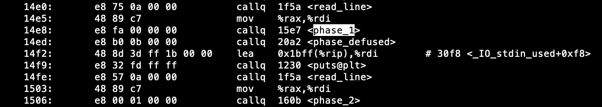
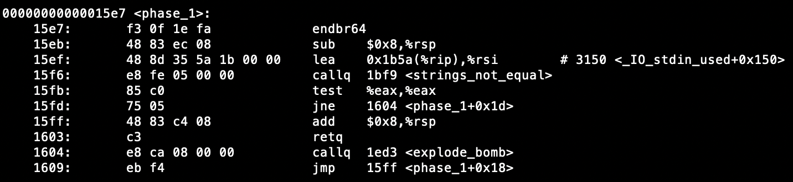

# Bomb Lab

## 1. 简介

本实验要求你使用课程所学知识拆除“binary bombs（二进制炸弹，下文将简称为炸弹）”，增强对程序的机器级表示、汇编语言、调试器和逆向工程等方面原理与技能的掌握。 这里的炸弹是一个Linux可执行程序，包含了6个阶段（或层次、关卡）。炸弹运行的每个阶段要求你输入一个特定字符串，你的输入符合程序预期的输入，该阶段的炸弹就被拆除引信即解除了，否则炸弹“爆炸”打印输出 "BOOM!!!"。实验的目标是拆除尽可能多的炸弹关卡。

每个炸弹阶段考察了机器级程序语言的一个不同方面，难度逐级递增：

- 阶段1：字符串比较
- 阶段2：循环
- 阶段3：条件/分支
- 阶段4：递归调用和栈
- 阶段5：指针
- 阶段6：链表/指针/结构

另外还有一个隐藏阶段，只有当你在第4阶段的解后附加一特定字符串后才会出现。

为完成二进制炸弹拆除任务，你需要使用gdb调试器和objdump来反汇编炸弹的可执行文件并跟踪调试每一阶段的机器代码，从中理解每一汇编语言代码的行为或作用，进而设法推断拆除炸弹所需的目标字符串。比如在每一阶段的开始代码前和引爆炸弹的函数前设置断点。

实验语言：C；实验环境：Linux

## 2. 实验步骤

### 2.1. 第一步：获取bomb

用git获取实验初始文件：

1. 在虚拟桌面左边窗口的上方点击“GitLab”。
2. “点击复制”按钮，复制git仓库地址。
3. 关闭上述界面，在左边窗口的上方点击“更多”，选择“剪切板”。
4. 在剪切板中ctrl+v贴入git仓库地址。
5. 关闭上述界面，在命令行界面中输入下述命令，你要把http地址替换成你的仓库地址，按照提示输入GitLab的用户名和密码:

```shell
git clone http://172.16.2.166/2020302111371/expProject2026-674.git csapp-bomblab
```

`csapp-bomblab`目录中包括这样一些文件：

- `bomb`: bomb的可执行程序。
- `bomb.c`: bomb程序的main函数。

### 2.2. 第二步：拆除bomb

本实验的任务就是拆除炸弹。一定要在指定的虚拟机上完成作业，在其他的环境上运行有可能导致失败。

运行`./bomb`可执行程序需要0或1个命令行参数（详见bomb.c源文件中的main函数）。如果运行时不指定参数，则该程序打印出欢迎信息后，期望你按行输入每一阶段用来拆除炸弹的字符串，根据你当前输入的字符串决定你是通过相应阶段还是炸弹爆炸导致任务失败。你也可将拆除每一阶段炸弹的字符串按行组织在一个文本文件中，然后作为运行程序时的唯一一个命令行参数传给程序，程序读入文件中的每一行直到遇到EOF，再转到从stdin等待输入。这样对于你已经拆除的炸弹，就不用每次都重新输入，只用放进文件里即可。

要学会单步跟踪调试汇编代码以及学会设置断点。你还要学会如何检查寄存器和内存状态。很好的使用调试器是你在未来的职业生涯中赚到更多money的一项重要技能！

### 2.3. 实验结果提交

这是一项独立实验，每个人单独完成。

把对bomb的输入文件命名为solution.txt，拷贝到桌面，点击评测。

solution.txt中每一行是一个阶段的输入，例如：

```txt
Hello, world!
430072 WHU
```

第一行是第一阶段的输入字符串；第二行是第二阶段的输入；不正确通过第x阶段，无法对x+1阶段的结果进行验证评分。

分数设置如下：

| Phase | 分数 |
| --- | --- |
| 1 | 10 |
| 2 | 20 |
| 3 | 35 |
| 4 | 50 |
| 5 | 70 |
| 6 | 95 |
| 隐藏关 | 100 |

## 3. 提示

下面简要说明完成本实验所需要的一些实验工具：

### gdb

为了从二进制可执行程序`./bomb`中找出触发bomb爆炸的条件，可使用gdb来帮助对程序的分析。gdb是GNU自由软件组织发布的一个强大的交互式程序调试工具。一般来说，gdb主要帮忙你完成下面几方面的功能（更详细描述可参看gdb文档和相关资料）：

- 装载、启动被调试的程序。
- 让被调试的程序在你指定的调试断点处中断执行，方便查看程序变量、寄存器、栈内容等运行现场数据。
- 动态改变程序的执行环境，如修改变量的值。

gdb相关资料：

[http://beej.us/guide/bggdb/](http://beej.us/guide/bggdb/)

[https://www.gnu.org/software/gdb/](https://www.gnu.org/software/gdb/)

### objdump

`objdump -t`

该命令可以打印出bomb的符号表。符号表包含了bomb中所有函数、全局变量的名称和存储地址。你可以通过查看函数名得到一些目标程序的信息。

`objdump -d`

该命令可用来对bomb中的二进制代码进行反汇编。通过阅读汇编源代码可以发现bomb是如何运行的。但是，`objdump -d`不能告诉你bomb的所有信息，例如一个调用sscanf函数的语句可能显示为：`8048c36: e8 99 fc ff ff call 80488d4 <_init+0x1a0>`，你还需要gdb来帮助你确定这个语句的具体功能。

### strings

该命令可以显示二进制程序中的所有可打印字符串。

### 实验步骤提示

下面以第一阶段（第一关）为例介绍实验步骤：首先调用 `objdump –d bomb > bomb_disas.txt` 对bomb进行反汇编并将汇编源代码输出到boombdisas.txt文本文件中。查看该汇编源代码文件，我们可以在main函数中找到如下语句，从而得知第一关的处理程序包含在main函数所调用的函数phase_1中，判断的过程可以参照bomb.c文件源码。汇编代码中地址0x14e8处调用了phase_1函数，



我们在反汇编代码中寻找这个子函数phase_1：



可以看到这个子函数比较小，只有几行汇编代码，可以进行简单阅读（如果汇编代码较多，不建议逐句阅读，而是借用gdb调试工具进行辅助）：我们看到（教科书中已经提到过调用函数的过程），………， 还调用了string_not_equal函数，接着测试%eax是否为零，如果是就跳转到+0x1d处，否则就调用explode_bomb，可以判定这是一个判断两个字符串是否相等的过程。

接下来，使用gdb调试bomb二进制文件：`gdb bomb`后，运行`break phase_1`，也就是在phase_1函数处设置一个断点，然后运行`run`，开始调试。运行`disa phase_1`，得到如下信息：


可以看到%rsi中装入的就是待比较的目标字符串地址，后面给出的0x555555557150就是计算出来的值。可以输入`print (char *)0x555555557150`，输出是


也可以`stepi`运行到`0x00005555555555f6`，然后`print /x $rsi`得到，


说明%rsi的值确实是`0x555555557150`，目标字符串的起始位置。

接下来，去设置断点去检测这个答案是否正确，我们kill当前程序的调试。再在`explode_bomb`处设置断点`break explode_bomb`，然后`run`开始运行，按照提示输入这个字符串：“When I get angry, Mr. Bigglesworth gets upset.”（不包括引号）


第一关解除。

> 重要的文件建议保存在工作路径：`/mnt/hgshare`下，如果容器出现故障，桌面还原之后，点击“更多”/“工作目录文件浏览”找回。